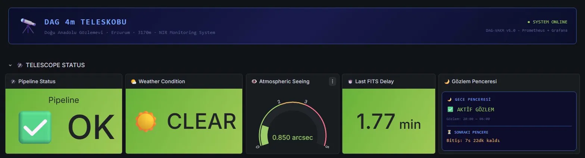
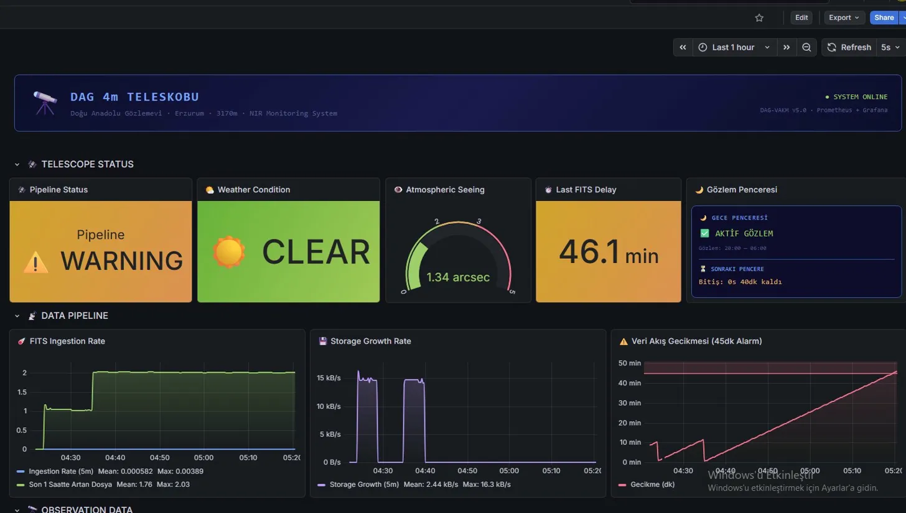
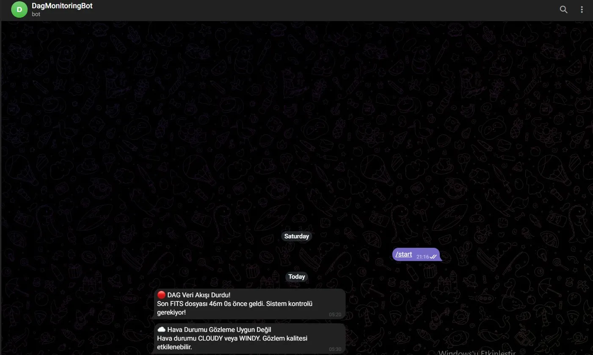
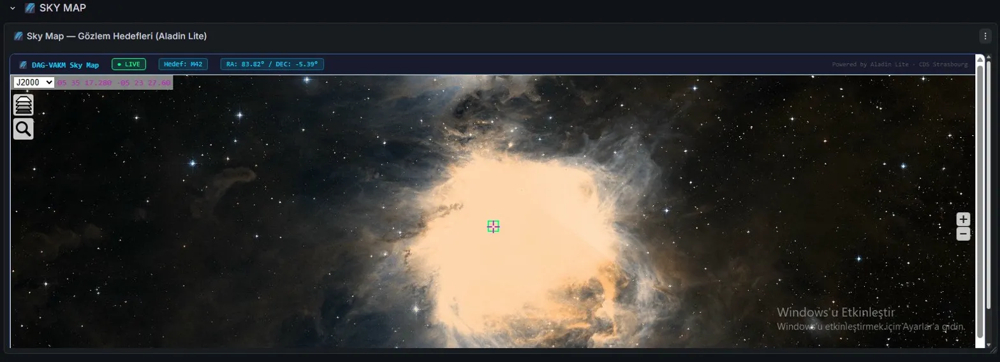
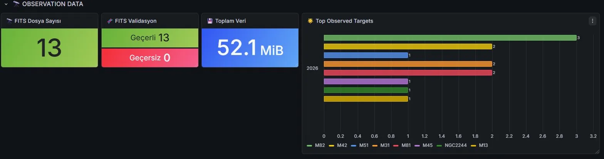
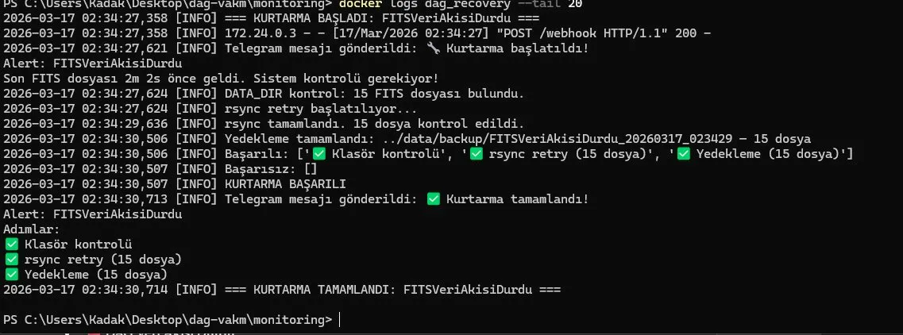

# 🔭 DAG-VAKM — NIR Data Pipeline Monitoring & Recovery System

> **Real-time observability platform for the Doğu Anadolu Gözlemevi (DAG) 4m Telescope**
> Built for high-altitude observatory operations at 3170m — Erzurum, Turkey.


---

## 🌌 Overview

Modern telescopes generate hundreds of GBs of scientific data every night under extreme environmental conditions. At high-altitude observatories, **network instability, power fluctuations, and disk failures** can cause irreversible scientific data loss.

**DAG-VAKM** is a DevOps-oriented solution designed specifically for the DAG telescope's NIR camera (DIRAC):

- 📡 Monitors FITS data pipelines **in real-time**
- 🚨 Sends **instant Telegram alerts** when anomalies are detected
- 🔧 Triggers **automated recovery workflows** (rsync retry + backup)
- 🌌 Visualizes everything on an **astronomy-themed Grafana dashboard**

---

## 🎥 Demo

| Normal Operation | Pipeline Warning | Alert & Recovery |
|---|---|---|
|  |  |  |

| Sky Map (Aladin Lite) | Top Observed Targets | Recovery Log |
|---|---|---|
|  |  |  |

---

## 🏗️ Architecture

```
┌─────────────────────────────────────────────────────────────┐
│                      DAG-VAKM Stack                          │
│                                                             │
│  ┌───────────────┐    ┌──────────────┐    ┌─────────────┐  │
│  │fits_generator │───▶│ fits_monitor │───▶│ Prometheus  │  │
│  │ (Simulator)   │    │ (Exporter)   │    │   :9090     │  │
│  └───────────────┘    └──────────────┘    └──────┬──────┘  │
│                                                  │          │
│  ┌───────────────┐    ┌──────────────┐    ┌──────▼──────┐  │
│  │   Telegram    │◀───│ Alertmanager │◀───│   Grafana   │  │
│  │     Bot       │    │    :9093     │    │    :3001    │  │
│  └───────────────┘    └──────┬───────┘    └─────────────┘  │
│                              │                              │
│                       ┌──────▼───────┐   ┌─────────────┐   │
│                       │   Recovery   │   │  Aladin     │   │
│                       │   Webhook    │   │  Sky Map    │   │
│                       │    :5001     │   │   :8888     │   │
│                       └─────────────┘   └─────────────┘   │
└─────────────────────────────────────────────────────────────┘
```

---

## ⚙️ Core Components

### 🔬 Telescope Simulator (`generator/fits_generator.py`)
- Generates realistic FITS files with authentic headers
- Uses a target catalog with Messier & NGC objects (M42, M31, NGC2244...)
- Simulates night mode (20:00–06:00), exposure times, filters (Y, J, H, K)
- Includes WCS coordinates, AIRMASS, SEEING, MOONPHASE metadata

### 📡 Metrics Exporter (`exporter/fits_monitor.py`)
- Custom Python Prometheus exporter
- Validates every FITS file via `astropy`
- Tracks ingestion rate, storage growth, and per-target observation counts
- Simulates atmospheric conditions (seeing, humidity, weather)

### 📊 Observability Stack (`monitoring/`)
- **Prometheus** — metric scraping and alert rule evaluation
- **Grafana** — astronomy-themed dashboard with provisioning
- **Alertmanager** — alert routing to Telegram + recovery webhook
- **nginx** — serves the interactive Aladin Lite sky map

### 🔧 Recovery Engine (`monitoring/recovery/`)
- Flask webhook server listens for Alertmanager triggers
- Executes: directory check → rsync retry → local backup
- Sends Telegram status updates throughout the process
- Logs all actions to `logs/recovery.log`

---

## 📊 Dashboard Panels

| Panel | Description |
|---|---|
| 🛰️ Pipeline Status | OK / WARNING / STOPPED with threshold-based color |
| 🌤️ Weather Condition | CLEAR / CLOUDY / WINDY simulation |
| 👁️ Atmospheric Seeing | 0–5 arcsec gauge with quality thresholds |
| ⏱️ Last FITS Delay | Minutes since last file arrival |
| 🌙 Observation Window | Night/day mode + countdown timer |
| ☄️ FITS Ingestion Rate | `rate()` and `increase()` metrics |
| 💾 Storage Growth Rate | bytes/sec growth visualization |
| 🌟 Top Observed Targets | Bar chart — observations per target |
| 🧬 FITS Validation | Valid vs invalid file count |
| 🌌 Sky Map | Real DSS sky imagery via Aladin Lite (CDS Strasbourg) |

---

## 🚨 Alert System

| Alert | Condition | Severity |
|---|---|---|
| `FITSVeriAkisiDurdu` | No FITS file for 45 minutes | 🔴 Critical |
| `DiskKritikSeviye` | Storage > 900 GB | ⚠️ Warning |
| `FITSGecersizDosya` | Corrupted FITS detected | ⚠️ Warning |
| `HavaDurumuKotu` | CLOUDY or WINDY | ℹ️ Info |

---

## 🔁 Auto-Recovery Workflow

```
Alert fires (45min no data)
    ↓
Alertmanager → Telegram: "🔴 DAG Veri Akışı Durdu!"
    ↓
Alertmanager → Webhook → recovery container
    ↓
recovery.py executes:
    ✅ Directory check
    ✅ rsync retry simulation
    ✅ Local backup (data/backup/)
    ✅ Log entry (logs/recovery.log)
    ↓
Telegram: "✅ Kurtarma tamamlandı!"
```

---

## 📡 Prometheus Metrics

| Metric | Type | Description |
|---|---|---|
| `dag_fits_files_total` | Gauge | Total FITS file count |
| `dag_fits_data_bytes_total` | Gauge | Total data size in bytes |
| `dag_last_fits_timestamp_seconds` | Gauge | Last FITS unix timestamp |
| `dag_fits_valid_total` | Gauge | Valid FITS count |
| `dag_fits_invalid_total` | Gauge | Invalid/corrupted FITS count |
| `dag_target_observation_total` | Gauge | Observations per target (labeled) |
| `dag_weather_condition` | Gauge | 0=CLEAR, 1=CLOUDY, 2=WINDY |
| `dag_weather_seeing_arcsec` | Gauge | Atmospheric seeing in arcseconds |
| `dag_weather_humidity_percent` | Gauge | Humidity percentage |
| `dag_target_ra` | Gauge | Active target RA (degrees) |
| `dag_target_dec` | Gauge | Active target DEC (degrees) |

---

## 📁 Project Structure

```
dag-vakm/
├── data/
│   └── raw_fits/               # Generated FITS files
├── generator/
│   ├── fits_generator.py       # Telescope simulator
│   └── catalog.json            # Observation targets
├── exporter/
│   └── fits_monitor.py         # Prometheus exporter
├── monitoring/
│   ├── docker-compose.yml
│   ├── prometheus.yml
│   ├── alerts.yml
│   ├── alertmanager.yml        # ⚠️ Add your tokens here
│   ├── .env                    # ⚠️ Create from .env.example
│   ├── .env.example
│   ├── dag_skymap.html
│   ├── grafana/
│   │   └── provisioning/
│   │       ├── dashboards/
│   │       └── datasources/
│   └── recovery/
│       ├── recovery.py
│       └── webhook_server.py
└── logs/
    └── recovery.log
```

---

## ⚡ Quick Start

### Prerequisites
- Docker + Docker Compose
- Python 3.11+
- Telegram Bot token (optional, for alerts)

### 1. Clone the repository
```bash
git clone https://github.com/mustafakadak/dag-vakm.git
cd dag-vakm
```

### 2. Configure Telegram (optional)
```bash
# Copy example env file
cp monitoring/.env.example monitoring/.env

# Edit with your credentials
# TELEGRAM_TOKEN=your_bot_token    (from @BotFather)
# TELEGRAM_CHAT_ID=your_chat_id   (from @userinfobot)
```

Also update `monitoring/alertmanager.yml`:
```yaml
bot_token: 'YOUR_BOT_TOKEN'
chat_id: YOUR_CHAT_ID
```

### 3. Start the monitoring stack
```bash
cd monitoring
docker compose up -d
```

### 4. Run the FITS simulator
```bash
cd generator
pip install astropy numpy
python fits_generator.py
```

### 5. Run the Prometheus exporter
```bash
cd exporter
pip install prometheus-client astropy
python fits_monitor.py
```

### 6. Open the dashboard
```
http://localhost:3001
Username: admin
Password: admin
```

---

## 🛠️ Tech Stack

| Technology | Usage |
|---|---|
| Python 3.11 | Exporter, simulator, recovery engine |
| astropy | FITS file I/O and validation |
| Prometheus | Metric collection and alerting |
| Grafana | Dashboard and visualization |
| Alertmanager | Alert routing and Telegram integration |
| Flask | Recovery webhook server |
| Docker Compose | Service orchestration |
| Aladin Lite | Real sky imagery (CDS Strasbourg) |
| nginx | Sky map static file serving |

---

## 🧠 What I Learned

- Designing real-time observability pipelines from scratch
- Building custom Prometheus exporters in Python
- Implementing alert-driven automation with webhook triggers
- Docker Compose service orchestration and networking
- FITS file format and astronomical metadata (WCS, RA/DEC)
- Grafana dashboard provisioning as code

---

## 🚧 Future Improvements

- Kubernetes (k3s) deployment for multi-server scaling
- MinIO/S3 distributed object storage integration
- Real DAG telescope API integration
- ML-based anomaly detection for seeing conditions
- GitHub Actions CI/CD pipeline

---

## 🎯 Why This Project?

DAG (Doğu Anadolu Gözlemevi) hosts Turkey's largest telescope — a 4-meter mirror at 3170m altitude. Its remote location makes IT infrastructure critical. This project demonstrates:

- **Real problem solving** — data loss prevention at a real observatory
- **DevOps + Astronomy** intersection
- **Production-ready** alerting and recovery mechanisms
- **Single-command deployment** via Docker Compose

---

## 📄 License

MIT License © 2026 Mustafa Kadak
